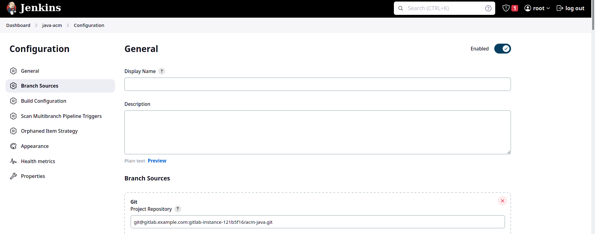

### Architecture


### Pre Installation

- produce self-singed for `registry` container

  ````bash
  # cd registry/certs/
  openssl req -newkey rsa:4096 -nodes -sha256 -keyout certs/domain.key -subj "/CN=myregistry.io"  -addext "subjectAltName = DNS:myregistry.io" -x509 -days 365 -out certs/domain.crt 
  ````

- `docker-compose` file:

  ````bash
  $> cat docker-compose.yaml 
  version: "3.9"
  services:
    registry:
      image: registry
      container_name: registry
      restart: on-failure
      hostname: myregistr.io
      environment:
        REGISTRY_HTTP_TLS_CERTIFICATE: /certs/domain.crt
        REGISTRY_HTTP_TLS_KEY: /certs/domain.key
      volumes:
        - ./registry/certs:/certs
        - gitlab-registry-vol:/var/lib/registry
      ports:
        - "5000:5000"
      networks:
        - jenkins-net
  
    gitlab-web:
      image: gitlab/gitlab-ce
      container_name: gitlab
      restart: always
      hostname: gitlab.example.com
      ports:
        - "4433:443"
        - "8090:80"
        - "2233:22"
      volumes:
        - gitlab-config:/etc/gitlab
        - gitlab-logs:/var/log/gitlab
        - gitlab-data:/var/opt/gitlab
      networks:
        - jenkins-net
      depends_on:
        - registry
  
    jenkins-docker-builder:
      image: docker:dind
      container_name: jenkins-docker-builder
      hostname: jenkins-docker-builder
      privileged: true
      restart: always
      environment:
        - DOCKER_TLS_CERTDIR:/certs
      volumes:
        - jenkins-docker-certs:/certs/client
        - jenkins-data:/var/jenkins_home
        - builder-data-vol:/var/lib
        - ./registry/certs/domain.crt:/etc/ssl/certs/ca-registry.pem:ro
      ports:
        - "2376:2376"
      networks:
        - jenkins-net
      command: --storage-driver overlay2
  
    jenkins-blueocean:
      build:
              #context: ./jenkins-blueocean
        dockerfile: ./jenkins-blueocean/Dockerfile
      container_name: jenkins-blueocean
      restart: on-failure
      environment:
        DOCKER_HOST: tcp://jenkins-docker-builder:2376
        DOCKER_CERT_PATH: /certs/builder-client
        DOCKER_TLS_VERIFY: "1"
      ports:
        - "8181:8080"
        - "50001:50000"
      volumes:
        - jenkins-data:/var/jenkins_home
        - jenkins-docker-certs:/certs/builder-client:ro
        - dev-docker-runner-certs:/certs/dev-client:ro
        - stg-docker-runner-certs:/certs/stg-client:ro
        - prd-docker-runner-certs:/certs/prd-client:ro
      networks:
        - jenkins-net
      depends_on:
        - jenkins-docker-builder
        - dev-docker-runner
        - stg-docker-runner
        - prd-docker-runner
  
    dev-docker-runner:
      image: docker:dind
      container_name: dev-docker-runner
      hostname: dev-docker-runner
      privileged: true
      restart: always
      environment:
        - DOCKER_TLS_CERTDIR:/certs
      volumes:
        - dev-docker-runner-certs:/certs/client
        - dev-docker-runner-dind-vol:/var/lib
        - jenkins-data:/var/jenkins_home
        - ./registry/certs/domain.crt:/etc/ssl/certs/ca-registry.pem:ro
      ports:
        - "2380:2376"
      networks:
        - jenkins-net
      command: --storage-driver overlay2
      depends_on:
        - jenkins-docker-builder
  
    stg-docker-runner:
      image: docker:dind
      container_name: stg-docker-runner
      hostname: stg-docker-runner
      privileged: true
      restart: always
      environment:
        - DOCKER_TLS_CERTDIR:/certs
      volumes:
        - stg-docker-runner-certs:/certs/client
        - stg-docker-runner-dind-vol:/var/lib
        - jenkins-data:/var/jenkins_home
        - ./registry/certs/domain.crt:/etc/ssl/certs/ca-registry.pem:ro
      ports:
        - "2381:2376"
      networks:
        - jenkins-net
      command: --storage-driver overlay2
      depends_on:
        - jenkins-docker-builder
  
    prd-docker-runner:
      image: docker:dind
      container_name: prd-docker-runner
      hostname: prd-docker-runner
      privileged: true
      restart: always
      environment:
        - DOCKER_TLS_CERTDIR:/certs
      volumes:
        - prd-docker-runner-certs:/certs/client
        - prd-docker-runner-dind-vol:/var/lib
        - jenkins-data:/var/jenkins_home
        - ./registry/certs/domain.crt:/etc/ssl/certs/ca-registry.pem:ro
      ports:
        - "2382:2376"
      networks:
        - jenkins-net
      command: --storage-driver overlay2
      depends_on:
        - jenkins-docker-builder
     
    nginx:
      image: nginx:latest
      container_name: nginx
      volumes:
        - ./local-nginx/nginx.conf:/etc/nginx/nginx.conf
        - ./local-nginx/conf.d/:/etc/nginx/conf.d
      ports:
        - "80:80"
      networks:
        - jenkins-net
      depends_on:
        - registry
        - dev-docker-runner
        - stg-docker-runner
        - prd-docker-runner
  
  networks:
    jenkins-net: {}
  
  volumes:
    gitlab-config: {}
    gitlab-logs: {}
    gitlab-data: {}
    jenkins-docker-certs: {}
    jenkins-data: {}
    gitlab-registry-vol: {}
    builder-data-vol: {}
    dev-docker-runner-certs: {}
    dev-docker-runner-dind-vol: {}
    stg-docker-runner-certs: {}
    stg-docker-runner-dind-vol: {}
    prd-docker-runner-certs: {}
    prd-docker-runner-dind-vol: {}
  ````

## Post installation

### Gitlab

- reset gitlab password

  ````bash
  gitlab-rake "gitlab:password:reset[root]"
  ````

- You should also configure GitLab to allow requests to your local network through the web UI. Here are the steps:

  1. Log in to your GitLab instance with an account that has administrative privileges.
  2. Navigate to the "Admin Area" by clicking on the wrench icon in the top-right corner of the GitLab interface and selecting "Admin Area" from the dropdown menu.
  3. In the Admin Area, click on the "Settings" tab in the left-hand menu.
  4. Scroll down to the "Network" section and click on the "Expand" button to view the advanced settings.
  5. Under the "Outbound requests" section, enable the "" option.
  6. Click the "Save changes" button at the bottom of the page to apply the changes.

- Define new project in `gitlab` and add remote to the your  project and push it like 

  ````bash
  cd my-source
  git init
  git remote add origin http://ip-address:8090/gitlab-instance-121b5f16/acm-java.git 
  git add .
  git commit -m "first commit"
  ````

- Produce ssh key public in the  `jenkins` container and add it into gitlab in preferences menu

  - ````bash
    $> ssk-keygen  
    ````

- Final `docker-compose.yml`

### Jenkins

- Install plugins

````bash
  jenkins-plugin-cli --plugins multibranch-scan-webhook-trigger:1.0.9
  jenkins-plugin-cli --plugins git:5.0.2
  jenkins-plugin-cli --plugins basic-branch-build-strategies:71.vc1421f89888e
  jenkins-plugin-cli --plugins docker-plugin:1.3.0
  jenkins-plugin-cli --plugins blueocean:1.27.4
  jenkins-plugin-cli --plugins docker-workflow:563.vd5d2e5c4007f
````

````bash
docker restart jenkins-bleocean
````

- Add project

  - Define `multibranch` pipeline project

  - Add git repository  in config like:

  - ````bash
    git@gitlab.example.com:gitlab-instance-121b5f16/acm-java.git # gitlab.example.com is hostname of docker of gitlab
    ````

    

  - In Behaviors: enable **Discover branches** and **Discover tags** and set your own branch

    

    

  - Define`webhook` token and set webhook url in gitlab-> (your project: settings-> webhook) like: 

    ````bash
    http://jenkins-blueocean:8080/multibranch-webhook-trigger/invoke?token=my-token
    ````

    

### Nginx 

- Setup `nginx` in every runners for forward traffics 

- pull and push `nginx`

  ````bash
  $$> docker exec -it dev-docker-runner sh
  $> docker pull nginx:latest
  $> docker image tag nginx:latest myregistry.io:5000/nginx:latest
  $> docker pull nginx:latest
  $> exist
  $$> for con in 'dev-docker-runner' 'stg-docker-runner' 'prd-docker-runner'; do docker exec $con docker pull myregistry.io:5000/nginx  ; done
  ````

- make a script to setup `nginx` in all runners

  ````bash
  $> cat setup_nginx.sh 
  #!/bin/bash
  for cnt in 'dev-docker-runner' 'stg-docker-runner' 'prd-docker-runner'; do 
          echo "setup: $cnt"
          docker exec  $cnt mkdir /root/nginx/
          docker cp nginx/dev.nginx.conf $cnt:/root/nginx/nginx.conf && docker cp nginx/conf.d $cnt:/root/nginx/ && docker cp nginx/docker-compose.yml $cnt:/root/nginx/
          docker exec $cnt docker compose -f  /root/nginx/docker-compose.yml  up -d 
          docker exec $cnt docker exec nginx nginx -s reload
  done 
  ````

  

### DNS Server [Optional]

- You can setup our own setup for `mydomain.io` with `dnsmasq`

  ````bash
  $> cat /etc/dnsmasq.conf
  address=/dev.mydomain.io/172.26.7.32
  address=/stg.mydomain.io/172.26.7.32
  address=/prd.mydomain.io/172.26.7.32
  
  ````

  
