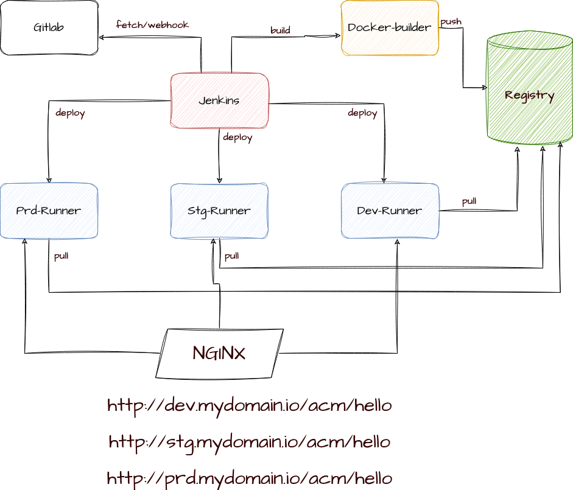

## jenkins

- Architecture

  


- produce self-singed for registry

```bash
# cd ./certs
openssl req -newkey rsa:4096 -nodes -sha256 -keyout certs/domain.key -subj "/CN=myregistry.io"  -addext "subjectAltName = DNS:myregistry.io" -x509 -days 365 -out certs/domain.crt 

```

- run registry

````bash
docker run --name registry --restart=on-failure  -d  \
  --network jenkins  --env REGISTRY_HTTP_TLS_CERTIFICATE=/certs/domain.crt \
  --env REGISTRY_HTTP_TLS_KEY=/certs/domain.key  --volume ./certs:/certs \
  --volume gitlab_registry-vol:/var/ -p 5000:5000  \
  registry:2
````


## jenkins-docker

````bash
docker run --name jenkins-docker --detach \
  --privileged --network jenkins --network-alias docker \
  --env DOCKER_TLS_CERTDIR=/certs \
  --volume jenkins-docker-certs:/certs/client \
  --volume jenkins-data:/var/jenkins_home --volume dind-vol:/var/lib \
  --publish 2376:2376 \
  docker:dind --storage-driver overlay2
````

##  blue-ocean jenkins

````bash
> cat Dockerfile                                                                                                                

FROM jenkins:2.60.3
USER root
RUN sed -i s/deb.debian.org/archive.debian.org/g /etc/apt/sources.list
RUN sed -i 's|security.debian.org|archive.debian.org/|g' /etc/apt/sources.list
RUN sed -i '/stretch-updates/d' /etc/apt/sources.list
RUN apt-get update 
RUN apt -y  install tsocks
RUN apt-get install -y lsb-release apt-transport-https
RUN curl -fsSLo /usr/share/keyrings/docker-archive-keyring.asc \
  https://download.docker.com/linux/debian/gpg
RUN echo "deb [arch=$(dpkg --print-architecture) \
  signed-by=/usr/share/keyrings/docker-archive-keyring.asc] \
  https://download.docker.com/linux/debian \
  $(lsb_release -cs) stable" > /etc/apt/sources.list.d/docker.list
RUN apt-get update && apt-get install -y docker-ce-cli
USER jenkins

docker build . -t jenkins-with-docker-cli
````


````bash
docker run --name jenkins-blueocean --restart=on-failure --detach \
  --network jenkins --env DOCKER_HOST=tcp://docker:2376 \
  --env DOCKER_CERT_PATH=/certs/client --env DOCKER_TLS_VERIFY=1 \
  --publish 8080:8080 --publish 50001:50000 \
  --volume jenkins-data:/var/jenkins_home \
  --volume jenkins-docker-certs:/certs/client:ro jenkins-with-docker-cli
````


## Post installation

- In jenkins container:

````bash
  jenkins-plugin-cli --plugins multibranch-scan-webhook-trigger:1.0.9
  jenkins-plugin-cli --plugins git:5.0.2
  jenkins-plugin-cli --plugins basic-branch-build-strategies:71.vc1421f89888e
  jenkins-plugin-cli --plugins docker-plugin:1.3.0
  jenkins-plugin-cli --plugins blueocean:1.27.4
  jenkins-plugin-cli --plugins docker-workflow:563.vd5d2e5c4007f
````

- reset gitlab password

  ````bash
  gitlab-rake "gitlab:password:reset[root]"
  ````

- Add registry ca certificate to `jenkins-docker-builder` and `docker-runner`s

- ````bash
  $$> docker exec -it jenkins-docker-builder sh
  $> openssl s_client -showcerts -connect myregistry.io:5000 </dev/null 2>/dev/null | openssl x509 -outform PEM > registry.crt
  $> mv registry.crt /etc/ssl/certs/ca-my-registry.pem
  $> exit
  $$> docker restart jenkins-docker-builder 
  $$> # please do for other runners
  ````

- Create network in all runners

- ````bash
  for con in 'dev-docker-runner' 'stg-docker-runner' 'prd-docker-runner'; do docker exec $con docker network create mydomain-network; done
  ````

- pull and push nginx

- ````bash
  $$> docker exec -it dev-docker-runner sh
  $> docker pull nginx:latest
  $> docker image tag nginx:latest myregistry.io:5000/nginx:latest
  $> docker pull nginx:latest
  $> exist
  $$> for con in 'dev-docker-runner' 'stg-docker-runner' 'prd-docker-runner'; do docker exec $con docker pull myregistry.io:5000/nginx  ; done
  ````

- make a script to setup nginx in all runners

- ````bash
  cat setup_nginx.sh 
  #!/bin/bash
  for cnt in 'dev-docker-runner' 'stg-docker-runner' 'prd-docker-runner'; do 
          echo "setup: $cnt"
          docker exec  $cnt mkdir /root/nginx/
          docker cp nginx/dev.nginx.conf $cnt:/root/nginx/nginx.conf && docker cp nginx/conf.d $cnt:/root/nginx/ && docker cp nginx/docker-compose.yml $cnt:/root/nginx/
          docker exec $cnt docker compose -f  /root/nginx/docker-compose.yml  up -d 
          docker exec $cnt docker exec nginx nginx -s reload
  
  
  done 
  
  ````

- Add a nginx container to forward all traffic to runners

  ````bash
   nginx:
      image: nginx:latest
      container_name: nginx
      volumes:
        - ./local-nginx/nginx.conf:/etc/nginx/nginx.conf
        - ./local-nginx/conf.d/:/etc/nginx/conf.d
      ports:
        - "80:80"
      networks:
        - jenkins-net
      depends_on:
        - registry
        - dev-docker-runner
        - stg-docker-runner
        - prd-docker-runner
  ````

  ````bash
  cat ./local-nginx/nginx.conf
  
  error_log /var/log/nginx/error.log debug;
  worker_processes 1;
  events { worker_connections 1024; }
  http {
      access_log /var/log/nginx/access.log;
      upstream dev {
          server dev-docker-runner:80;
      }
      upstream stg {
          server stg-docker-runner:80;
      }
      upstream prd {
          server prd-docker-runner:80;
      }
  
     server {
           listen 80;
           server_name dev.mydomain.io;
            location / {
                proxy_pass http://dev/;
                proxy_set_header Host $host;
                proxy_set_header X-Real-IP $remote_addr;
                proxy_set_header X-Forwarded-For $proxy_add_x_forwarded_for;
          }
    
       }
      server {
           listen 80;
           server_name stg.mydomain.io;
            location / {
                proxy_pass http://stg/;
                proxy_set_header Host $host;
                proxy_set_header X-Real-IP $remote_addr;
                proxy_set_header X-Forwarded-For $proxy_add_x_forwarded_for;
          }
      }
      server {
           listen 80;
           server_name prd.mydomain.io;
            location / {
                proxy_pass http://prd/;
                proxy_set_header Host $host;
                proxy_set_header X-Real-IP $remote_addr;
                proxy_set_header X-Forwarded-For $proxy_add_x_forwarded_for;
          }
      }
  }
  
  
  
  ````

  - `./local-nginx/conf.d` is empty to avoid run default.conf

- You should also configure GitLab to allow requests to your local network through the web UI. Here are the steps:

  1. Log in to your GitLab instance with an account that has administrative privileges.
  2. Navigate to the "Admin Area" by clicking on the wrench icon in the top-right corner of the GitLab interface and selecting "Admin Area" from the dropdown menu.
  3. In the Admin Area, click on the "Settings" tab in the left-hand menu.
  4. Scroll down to the "Network" section and click on the "Expand" button to view the advanced settings.
  5. Under the "Outbound requests" section, enable the "" option.
  6. Click the "Save changes" button at the bottom of the page to apply the changes.

- add remote to current project and push it like 

  ````bash
  cd my-source
  git init
  git remote add origin http://ip-address:8090/gitlab-instance-121b5f16/acm-java.git 
  ````

- in `jenkins` container:

  - ````bash
    $> ssk-keygen   # add public key to ssh key list of gitlab in preferences menu
    ````

- In `jenkins` web:

  - define `multibranch` pipeline project

  - add git repository  in config like:

  - ````bash
    git@gitlab.example.com:gitlab-instance-121b5f16/acm-java.git # gitlab.example.com is hostname of docker of gitlab
    ````

  - In Behaviors: enable **Discover branches** and **Discover tags** and set your own branch

  - Define`webhook` token and set webhook url in gitlab-> (your project: settings-> webhook) like: 

  - ````
    http://jenkins-blueocean:8080/multibranch-webhook-trigger/invoke?token=my-token
    ````

- Final `docker-compose.yml`

  ````bash
  cat docker-compose.yaml 
  version: "3.9"
  services:
    registry:
      image: registry
      container_name: registry
      restart: on-failure
      hostname: myregistry.io
      environment:
        REGISTRY_HTTP_TLS_CERTIFICATE: /certs/domain.crt
        REGISTRY_HTTP_TLS_KEY: /certs/domain.key
      volumes:
        - ./registry/certs:/certs
        - gitlab-registry-vol:/var/lib/registry
      ports:
        - "5000:5000"
      networks:
        - jenkins-net
  
    gitlab-web:
      image: gitlab/gitlab-ce
      container_name: gitlab
      restart: always
      hostname: gitlab.example.com
      ports:
        - "4433:443"
        - "8090:80"
        - "2233:22"
      volumes:
        - gitlab-config:/etc/gitlab
        - gitlab-logs:/var/log/gitlab
        - gitlab-data:/var/opt/gitlab
      networks:
        - jenkins-net
      depends_on:
        - registry
  
    jenkins-docker-builder:
      image: docker:dind
      container_name: jenkins-docker-builder
      hostname: jenkins-docker-builder
      privileged: true
      restart: always
      environment:
        - DOCKER_TLS_CERTDIR:/certs
      volumes:
        - jenkins-docker-certs:/certs/client
        - jenkins-data:/var/jenkins_home
        - builder-data-vol:/var/lib
      ports:
        - "2376:2376"
      networks:
        - jenkins-net
      command: --storage-driver overlay2
  
    jenkins-blueocean:
      build:
              #context: ./jenkins-blueocean
        dockerfile: ./jenkins-blueocean/Dockerfile
      container_name: jenkins-blueocean
      restart: on-failure
      environment:
        DOCKER_HOST: tcp://jenkins-docker-builder:2376
        DOCKER_CERT_PATH: /certs/builder-client
        DOCKER_TLS_VERIFY: "1"
      ports:
        - "8181:8080"
        - "50001:50000"
      volumes:
        - jenkins-data:/var/jenkins_home
        - jenkins-docker-certs:/certs/builder-client:ro
        - dev-docker-runner-certs:/certs/dev-client:ro
        - stg-docker-runner-certs:/certs/stg-client:ro
        - prd-docker-runner-certs:/certs/prd-client:ro
      networks:
        - jenkins-net
      depends_on:
        - jenkins-docker-builder
        - dev-docker-runner
        - stg-docker-runner
        - prd-docker-runner
  
    dev-docker-runner:
      image: docker:dind
      container_name: dev-docker-runner
      hostname: dev-docker-runner
      privileged: true
      restart: always
      environment:
        - DOCKER_TLS_CERTDIR:/certs
      volumes:
        - dev-docker-runner-certs:/certs/client
        - dev-docker-runner-dind-vol:/var/lib
        - jenkins-data:/var/jenkins_home
      ports:
        - "2380:2376"
      networks:
        - jenkins-net
      command: --storage-driver overlay2
      depends_on:
        - jenkins-docker-builder
  
    stg-docker-runner:
      image: docker:dind
      container_name: stg-docker-runner
      hostname: stg-docker-runner
      privileged: true
      restart: always
      environment:
        - DOCKER_TLS_CERTDIR:/certs
      volumes:
        - stg-docker-runner-certs:/certs/client
        - stg-docker-runner-dind-vol:/var/lib
        - jenkins-data:/var/jenkins_home
      ports:
        - "2381:2376"
      networks:
        - jenkins-net
      command: --storage-driver overlay2
      depends_on:
        - jenkins-docker-builder
  
    prd-docker-runner:
      image: docker:dind
      container_name: prd-docker-runner
      hostname: prd-docker-runner
      privileged: true
      restart: always
      environment:
        - DOCKER_TLS_CERTDIR:/certs
      volumes:
        - prd-docker-runner-certs:/certs/client
        - prd-docker-runner-dind-vol:/var/lib
        - jenkins-data:/var/jenkins_home
      ports:
        - "2382:2376"
      networks:
        - jenkins-net
      command: --storage-driver overlay2
      depends_on:
        - jenkins-docker-builder
     
    nginx:
      image: nginx:latest
      container_name: nginx
      volumes:
        - ./local-nginx/nginx.conf:/etc/nginx/nginx.conf
        - ./local-nginx/conf.d/:/etc/nginx/conf.d
      ports:
        - "80:80"
      networks:
        - jenkins-net
      depends_on:
        - registry
        - dev-docker-runner
        - stg-docker-runner
        - prd-docker-runner
  
  networks:
    jenkins-net: {}
  
  volumes:
    gitlab-config: {}
    gitlab-logs: {}
    gitlab-data: {}
    jenkins-docker-certs: {}
    jenkins-data: {}
    gitlab-registry-vol: {}
    builder-data-vol: {}
    dev-docker-runner-certs: {}
    dev-docker-runner-dind-vol: {}
    stg-docker-runner-certs: {}
    stg-docker-runner-dind-vol: {}
    prd-docker-runner-certs: {}
    prd-docker-runner-dind-vol: {}
  
  ````

  ````bash
  cat  jenkins-blueocean/Dockerfile 
  FROM jenkins/jenkins:latest
  USER root
  #RUN sed -i s/deb.debian.org/archive.debian.org/g /etc/apt/sources.list
  #RUN sed -i 's|security.debian.org|archive.debian.org/|g' /etc/apt/sources.list
  #RUN sed -i '/stretch-updates/d' /etc/apt/sources.list
  RUN apt-get update 
  #RUN apt -y  install tsocks
  RUN apt-get install -y lsb-release apt-transport-https
  RUN curl -fsSLo /usr/share/keyrings/docker-archive-keyring.asc \
    https://download.docker.com/linux/debian/gpg
  RUN echo "deb [arch=$(dpkg --print-architecture) \
    signed-by=/usr/share/keyrings/docker-archive-keyring.asc] \
    https://download.docker.com/linux/debian \
    $(lsb_release -cs) stable" > /etc/apt/sources.list.d/docker.list
  RUN apt-get update && apt-get install -y docker-ce-cli
  USER jenkins
  ````

  

